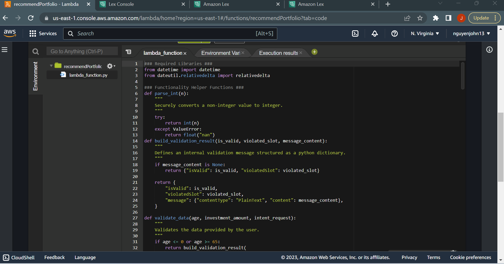
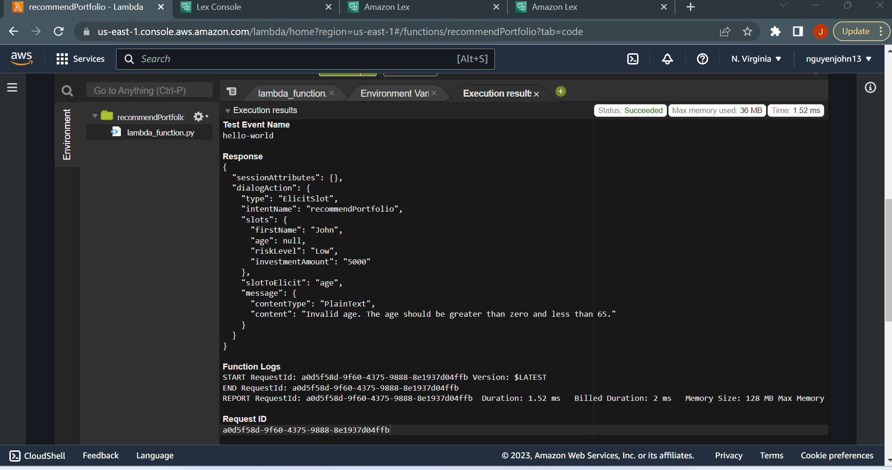
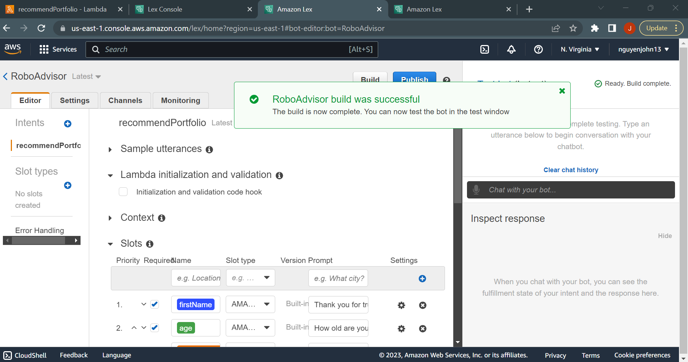

# Module_15_Challenge
# Configure the Initial Robo Advisor

### WARNING
Was not able to get AWS Lambda to work with AWS ROBO Advisor. Tutor Aarti Couture advised me to tell you about not being able to get the function to work.

Hello, this project is about the Build and Test the Robo Advisor. A Robo Advisor is a type of financial advisor that uses automation and algorithms to provide automated, algorithm-driven financial planning services with little to no human intervention. These platforms use advanced technology to analyze a client's financial situation, risk tolerance, and investment goals to provide personalized investment recommendations and portfolio management.

---

## Technologies

Here are the steps to build and test the Robo Advisor:

Create the Amazon Lex Bot:

Go to the Amazon Lex Console (https://console.aws.amazon.com/lex/).
Click on "Create" to create a new bot.
Configure your bot by providing a name, language, and output voice.
Create the necessary intents and slots to collect user information (e.g., age, investment amount, risk level).
Create the AWS Lambda Function:

Go to the AWS Lambda Console (https://console.aws.amazon.com/lambda/).
Click on "Create function" to create a new Lambda function.
Choose "Author from scratch" and provide a name for your function.
Select the Python 3.7 runtime.
In the code editor, paste the corrected code for the Lambda function provided earlier.
Save the Lambda function.
Configure Integration between Lex and Lambda:

Go back to the Amazon Lex Console and select your bot.
In the "Editor" tab, click on "Lambda initialization and validation" and choose your Lambda function from the dropdown list.
Click on "Fulfillment" and choose your Lambda function from the dropdown list.
Build and Test the Bot:

Click on the "Build" button to build your bot with the updated configuration.
Test your bot using the test chat interface provided in the Lex Console.
Input sample user responses for the slots (e.g., age, investment amount, risk level) and verify if the responses are correct.
Iterate and Improve:

Review the responses and validation logic of your bot.
Iterate and improve the bot based on user feedback and testing results.
Publish the Bot:

Once you are satisfied with the performance of your bot, click on "Publish" to make it available for use.

---

## Usage

Use Plots and data frame to get the correct portfolio

---

## Contributors

-Name: John Nguyen
-Email: nguyenjohn1337@gmail.com

---

## License

Specify the details of your project’s license - that is, how others can or cannot use your code and files.
